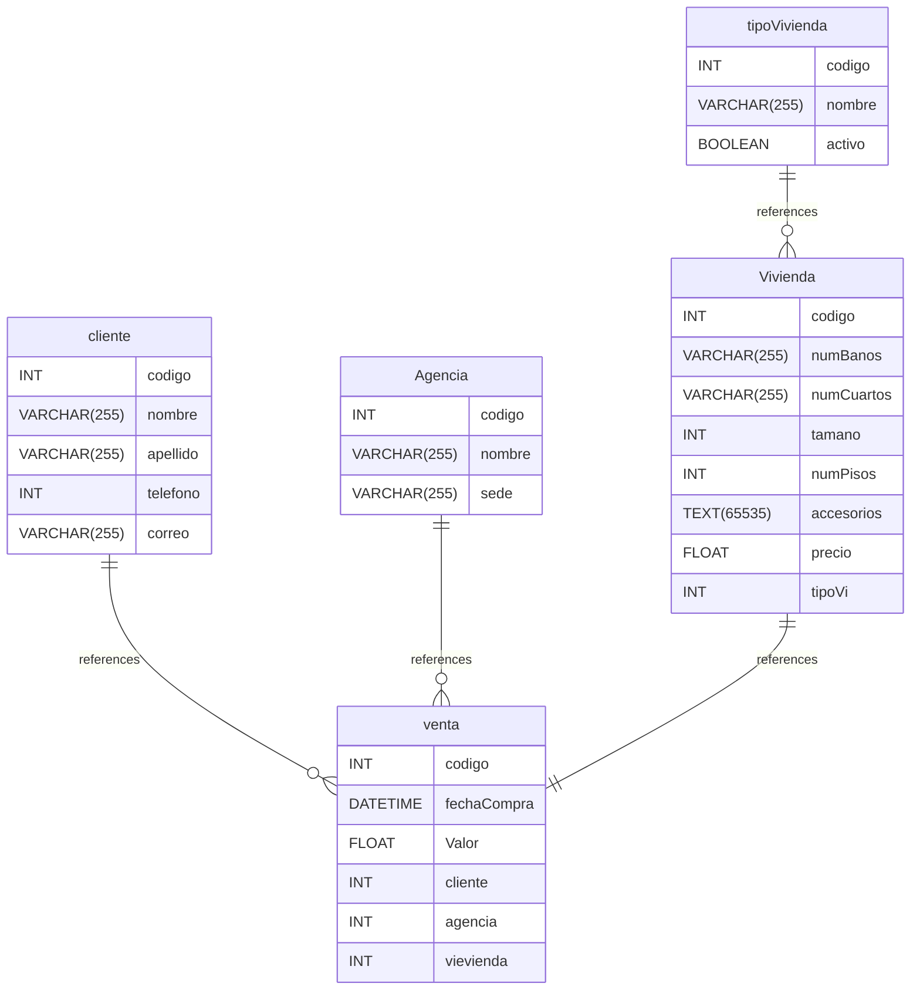

# Examen_1_AppServWEB_Mi_18_20
Examen evaluativo de la asignatura Aplicaciones y Servicios Web.

## Descripción del Problema ❔
La agencia de venta de viviendas "ITM" tiene una única sede ubicada en la ciudad de
Medellín. Requiere un sistema para grabar las ventas de las viviendas que ofrece, sólo
ofrece viviendas nuevas.
El sistema debe permitir grabar las viviendas con sus principales características: 
número de cuartos, número de baños, Tamaño (En metros cuadrados), número de pisos,
y accesorios (Es un texto libre para ingresar las características: patio, jardín,
zonas comunes, etc).
Para el modelo solo debe considerar la agencia, el cliente, el tipo de vivienda (Casa,
apartamento, finca, etc), la vivienda y la venta. Considere que un cliente sólo compra 
una vivienda a la vez, es decir, puede comprar muchas viviendas en el tiempo, pero solo 
uno por "venta", y que como son viviendas nuevas, una vivivenda sólo se vende a un cliente.
No considere un modelo con tablas de referencia como el país, departamento, ciudad, 
urbanización, entre otras. Sólo considere las entidades sugeridas: agencia, cliente,
tipo de vivienda, vivienda y venta.

### Se solicita : ✏️ ✔️
- Debe crear una base de datos en SQL Server con el diagrama de datos que tenga las relaciones
entre las tablas.
- Elabore un servicio REST para Elaborar consultas (Al menos dos), el insert, update y delete
en la base de datos para el registro de las viviendas.
- Implemente las pruebas de todos los servicios desde Postman y grabe la información de ellas.

## Tablas 📑
# Untitled Diagram documentation
## Summary

- [Introduction](#introduction)
- [Database Type](#database-type)
- [Table Structure](#table-structure)
	- [Vivienda ](#Vivienda )
	- [Agencia](#Agencia)
	- [cliente](#cliente)
	- [tipoVivienda](#tipoVivienda)
	- [venta](#venta)
- [Relationships](#relationships)
- [Database Diagram](#database-Diagram)

## Introduction

## Database type

- **Database system:** Generic
## Table structure

### Vivienda 

| Name        | Type          | Settings                      | References                    | Note                           |
|-------------|---------------|-------------------------------|-------------------------------|--------------------------------|
| **codigo** | INT | 🔑 PK, not null , unique, autoincrement | fk_Vivienda _codigo_venta | |
| **numBanos** | VARCHAR(255) | not null  |  | |
| **numCuartos** | VARCHAR(255) | not null  |  | |
| **tamano** | INT | not null  |  | |
| **numPisos** | INT | not null  |  | |
| **accesorios** | TEXT(65535) | not null  |  | |
| **precio** | FLOAT | not null  |  | |
| **tipoVi** | INT | not null  |  | | 

### Agencia

| Name        | Type          | Settings                      | References                    | Note                           |
|-------------|---------------|-------------------------------|-------------------------------|--------------------------------|
| **codigo** | INT | 🔑 PK, not null , unique, autoincrement | fk_Agencia_codigo_venta | |
| **nombre** | VARCHAR(255) | not null  |  | |
| **sede** | VARCHAR(255) | not null  |  | | 

### cliente

| Name        | Type          | Settings                      | References                    | Note                           |
|-------------|---------------|-------------------------------|-------------------------------|--------------------------------|
| **codigo** | INT | 🔑 PK, not null , unique, autoincrement | fk_cliente_codigo_venta | |
| **nombre** | VARCHAR(255) | not null  |  | |
| **apellido** | VARCHAR(255) | not null  |  | |
| **telefono** | INT | not null  |  | |
| **correo** | VARCHAR(255) | not null  |  | | 

### tipoVivienda

| Name        | Type          | Settings                      | References                    | Note                           |
|-------------|---------------|-------------------------------|-------------------------------|--------------------------------|
| **codigo** | INT | 🔑 PK, not null , unique, autoincrement | fk_tipoVivienda_codigo_Vivienda  | |
| **nombre** | VARCHAR(255) | not null  |  | |
| **activo** | BOOLEAN | not null  |  | | 

### venta

| Name        | Type          | Settings                      | References                    | Note                           |
|-------------|---------------|-------------------------------|-------------------------------|--------------------------------|
| **codigo** | INT | 🔑 PK, not null , unique, autoincrement |  | |
| **fechaCompra** | DATETIME | not null  |  | |
| **Valor** | FLOAT | not null  |  | |
| **cliente** | INT | not null  |  | |
| **agencia** | INT | not null  |  | |
| **vievienda** | INT | not null  |  | | 

## Relationships

- **cliente to venta**: one_to_many
- **tipoVivienda to Vivienda **: one_to_many
- **Agencia to venta**: one_to_many
- **Vivienda  to venta**: one_to_one

## Database Diagram

## Diagrama 📎

## Video: Explicativo y Desmostrativo (Codigo+Postman) 🔴

## Contribuidores 🫂
<!-- readme: contributors -start -->
<table>
	<tbody>
		<tr>
            <td align="center">
                <a href="https://github.com/ArsJohan">
                    
                     
                    <b>Johan   Esteban Arias</b>
                </a>
            </td>
		</tr>
	<tbody>
</table>
<!-- readme: contributors -end -->

